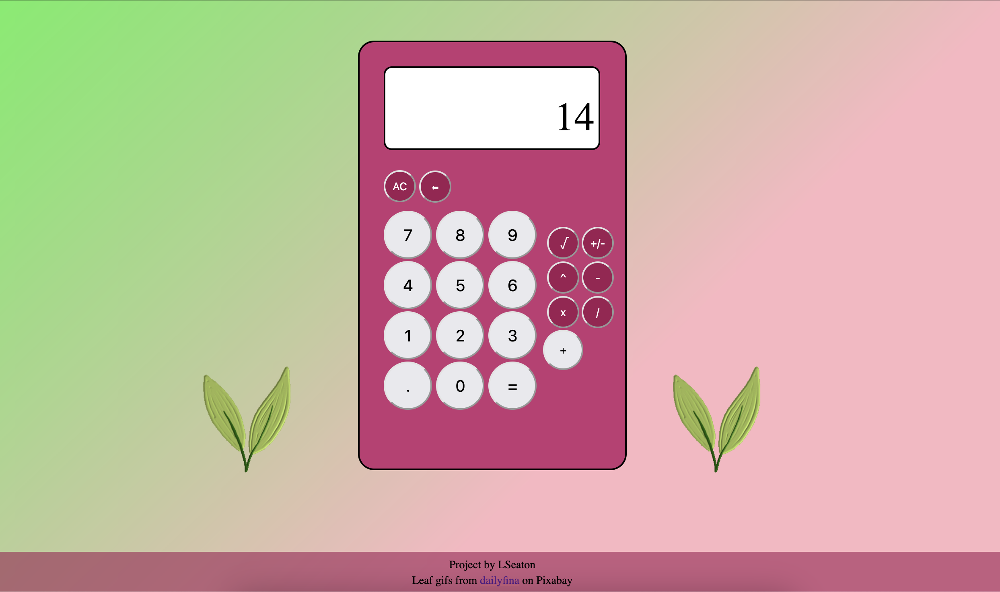

<h2>Project: Calculator from The Odin Project</h2>

We were challenged to build a calculator from scratch in javascript, implementing all the different operations ourselves.

See the live here: https://lseaton.github.io/odin-calculator.

<h3>Tools:</h3>
<ul>Visual Studio Code, Git, Github</ul>
<h3>Screenshot:</h3>

Credits: Leaf gif from <a href="https://pixabay.com/users/dailyfina-36282190/">dailyfina</a> on pixabay

